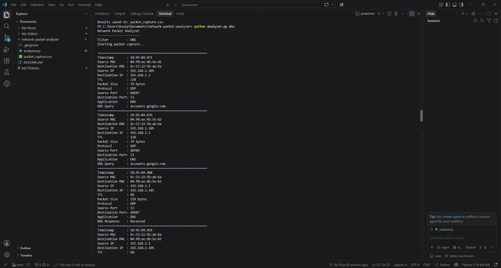
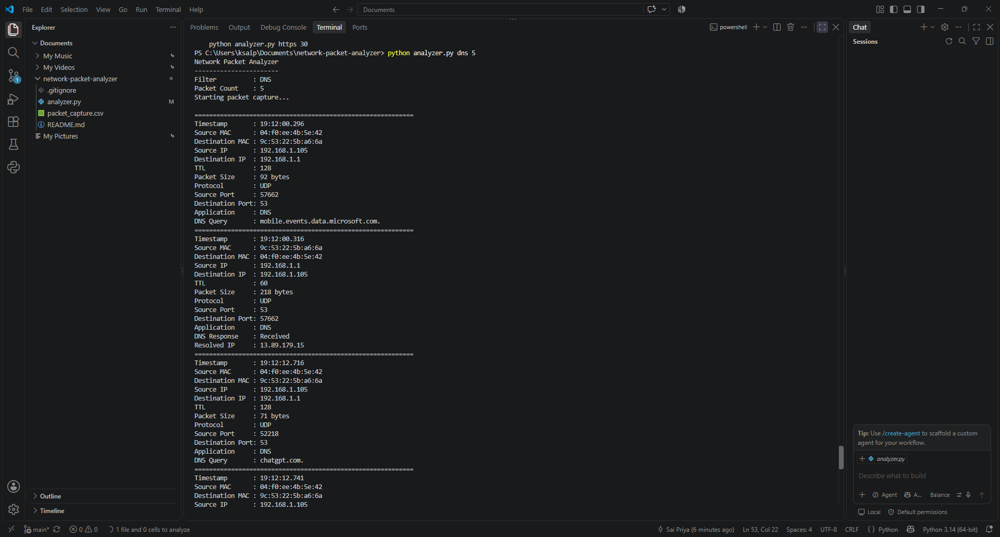

\# Network Packet Analyzer


A Python-based network packet analyzer built using \*\*Scapy\*\* to capture, inspect, classify, and log network traffic in real time.


The project analyzes network packets and extracts useful information such as IP addresses, MAC addresses, ports, protocols, TCP flags, DNS queries, DNS responses, packet sizes, and traffic statistics.


\## Features


\* Real-time packet capture

\* TCP, UDP, and ICMP protocol detection

\* Source and destination IP address extraction

\* Source and destination MAC address extraction

\* Source and destination port identification

\* IP TTL inspection

\* Packet size analysis

\* TCP flag inspection

\* HTTPS traffic detection based on TCP port 443

\* DNS query detection

\* DNS response detection

\* IPv4 address extraction from DNS responses

\* Packet filtering

\* Packet count control

\* Traffic percentage statistics

\* Byte-level traffic statistics

\* Timestamp for every captured packet

\* CSV logging of captured packet information

\* Command-line interface


\## Technologies Used


\* Python

\* Scapy

\* Npcap

\* CSV

\* Command Line Interface

\* Basic Computer Networking


\## Networking Concepts Demonstrated


This project provides practical exposure to:


\* TCP/IP

\* TCP

\* UDP

\* ICMP

\* DNS

\* HTTPS

\* IP addressing

\* MAC addressing

\* Port numbers

\* TTL

\* TCP flags

\* Packet filtering

\* Network traffic analysis


\## Project Structure


```text

network-packet-analyzer/

│

├── analyzer.py

├── README.md

└── .gitignore

```


`packet\_capture.csv` is generated automatically during execution and is excluded from Git using `.gitignore`.


\## Requirements


\* Python 3.x

\* Scapy

\* Npcap

\* Windows operating system


Npcap is required for packet capture on Windows.


\## Installation


\### 1. Clone the repository


```bash

git clone https://github.com/SaiPriyaaaa29/network-packet-analyzer.git
```


\### 2. Open the project directory


```bash

cd network-packet-analyzer

```


\### 3. Install Scapy


```bash

python -m pip install scapy

```


\### 4. Install Npcap


Install Npcap on Windows before running the packet analyzer.


\## Usage


Run the analyzer with the default configuration:


```bash

python analyzer.py

```


Capture DNS packets:


```bash

python analyzer.py dns

```


Capture TCP packets:


```bash

python analyzer.py tcp

```


Capture UDP packets:


```bash

python analyzer.py udp

```


Capture ICMP packets:


```bash

python analyzer.py icmp

```


Capture TCP port 443 traffic:


```bash

python analyzer.py https

```


Capture a specific number of packets:


```bash

python analyzer.py dns 20

```


For example:


```bash

python analyzer.py tcp 50

```


captures 50 TCP packets.


\## Available Filters


| Filter  | Description                     |

| ------- | ------------------------------- |

| `all`   | Capture all supported traffic   |

| `tcp`   | Capture TCP traffic             |

| `udp`   | Capture UDP traffic             |

| `icmp`  | Capture ICMP traffic            |

| `dns`   | Capture DNS traffic             |

| `https` | Capture TCP traffic on port 443 |

## Screenshots

### DNS Packet Analysis

The analyzer captures and displays detailed DNS packet information including source and destination addresses, ports, DNS queries, responses, and resolved IPv4 addresses.



### Traffic Capture Summary

The analyzer provides protocol-level packet counts, traffic percentages, and byte-level statistics after packet capture.




\## Example Output


```text

Network Packet Analyzer

\-----------------------

Filter          : DNS

Packet Count    : 10

Starting packet capture...


============================================================

Timestamp       : 18:40:40.355

Source MAC      : XX:XX:XX:XX:XX:XX

Destination MAC : XX:XX:XX:XX:XX:XX

Source IP       : 192.168.1.105

Destination IP  : 192.168.1.1

TTL             : 128

Packet Size     : 82 bytes

Protocol        : UDP

Source Port     : 52143

Destination Port: 53

Application     : DNS

DNS Query       : chatgpt.com.

```


DNS responses can also show resolved IPv4 addresses:


```text

DNS Response    : Received

Resolved IP     : XXX.XXX.XXX.XXX

```


\## Capture Summary


After packet capture, the analyzer displays statistics such as:


```text

============================================================

&#x20;                CAPTURE SUMMARY

============================================================

Total Packets : 10

TCP Packets   : 6

UDP Packets   : 4

ICMP Packets  : 0

DNS Packets   : 3

HTTPS Packets : 2

Other Packets : 0

============================================================

```


It also displays traffic percentages and total bytes captured.


\## CSV Logging


The analyzer automatically records packet information in:


```text

packet\_capture.csv

```


The CSV contains fields such as:


\* Timestamp

\* Source MAC

\* Destination MAC

\* Source IP

\* Destination IP

\* TTL

\* Packet Size

\* Protocol

\* Source Port

\* Destination Port

\* Application

\* DNS Query

\* Resolved IP


The generated CSV file is excluded from Git because it contains data from the local network environment.


\## Important Note


HTTPS detection in this project is based on TCP port `443`. The analyzer does not decrypt HTTPS traffic.


Similarly, MAC addresses observed during Wi-Fi capture generally represent devices on the local network link, such as the local machine and access point/router.


\## Future Improvements


Possible future enhancements include:


\* Protocol distribution visualization

\* Interactive dashboard

\* PCAP file export/import

\* Advanced protocol analysis

\* HTTP/3 and QUIC detection

\* Configurable packet capture duration

\* Network anomaly detection

\* Packet search and filtering

\* Improved logging and reporting


\## Learning Outcomes


Through this project, I gained practical experience with:


\* Network packet structure

\* TCP/IP networking

\* Packet capture

\* Protocol identification

\* DNS analysis

\* Network filtering

\* Python system-level programming

\* Command-line interfaces

\* CSV-based data logging

\* Network traffic statistics


\## Author


\*\*Sai Priya\*\*


B.Tech – Artificial Intelligence \& Machine Learning

Aditya College of Engineering and Technology


